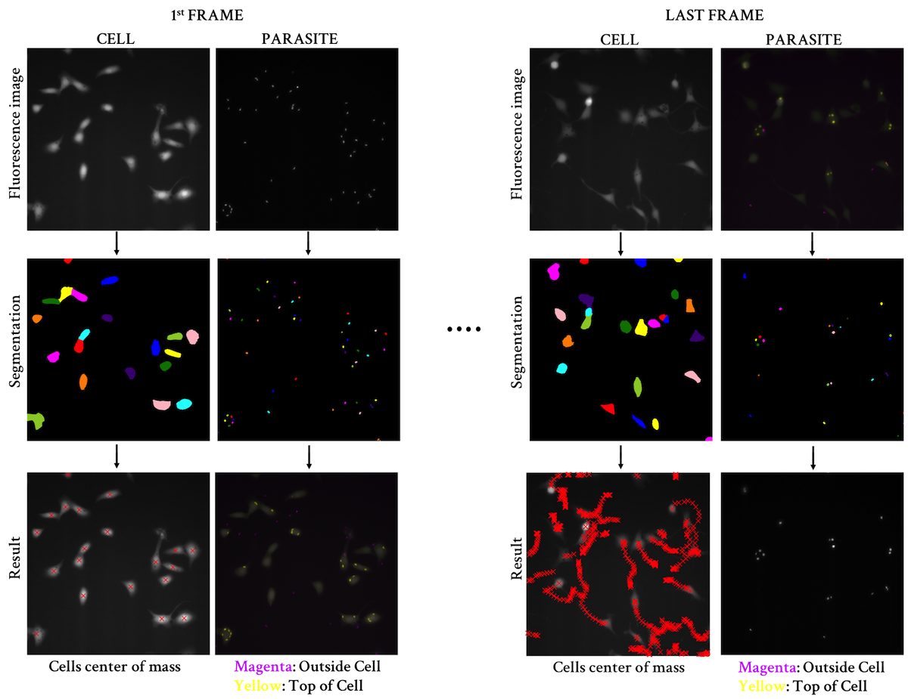

# Development of a tailored cell division tracking software

### Investigators:

Suchita Rastogi, Graduate Student  
John Boothroyd, Ph.D.

## Biological project:

 *Toxoplasma gondii* manipulates host cells by introducing two waves of effector proteins into the host cytosol.

We are interested in the first wave, which occurs immediately prior to invasion, where *Toxoplasma* injects host cells with proteins from a specialized secretory organelle called the rhoptry. We wants to characterize the host response to *Toxoplasma gondii* rhoptry secretion

 Looking at daughter cells (U-Id cells) of host cells that Toxoplasma parasites inject with rhoptry proteins, but then subsequently fail to invade (U-I cells).

### Problem:

#### How to distinguish a U-Id cells from an infected host cell that gives rise to a daughter cell that fails to inherit any parasites. Need to calculate how often an infected cells to not transmit the parasite to the daughter cell.

Questions to answer:

1.  For each cell, the time at which it gets infected with a parasite
2.  For each cell, whether it divides, and if so the time at which the division occurred
3.  For every infected cell that divided, the amount of time that elapsed between infection and division
4.  The parasite count in every mother cell at all time points.
5.  The parasite count in every daughter cell at all time points to monitor which daughter cells inherited parasites.

## SCIPY – Python-based ecosystems

*  Jupyter notebooks (code testing, data analysis, sharing data)

*  NumPy (Powerful for working with array data)

*  Matplotlib (Data plotting)

*  Pandas (Structuring the data, row and axis)

*  SciKits (SciPy ToolKits) ==> scikit-image

# pipeline

